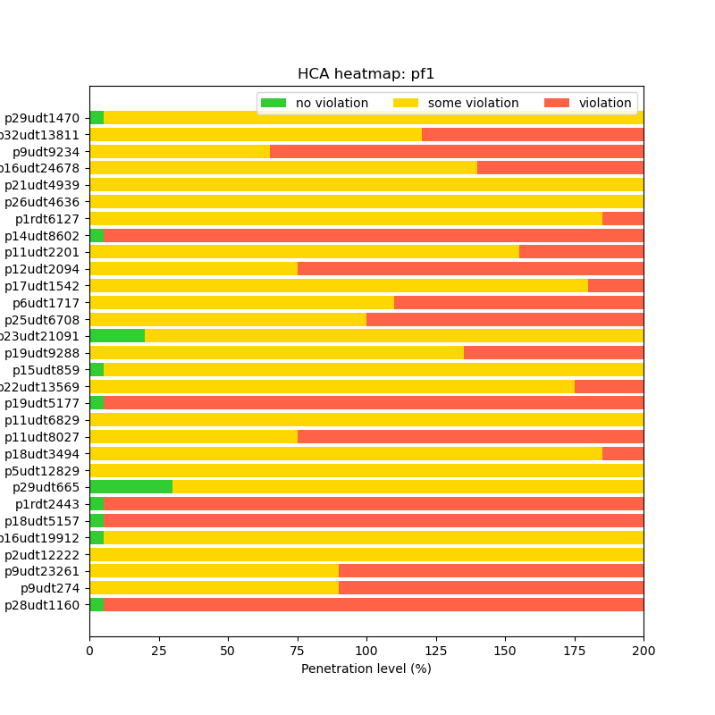
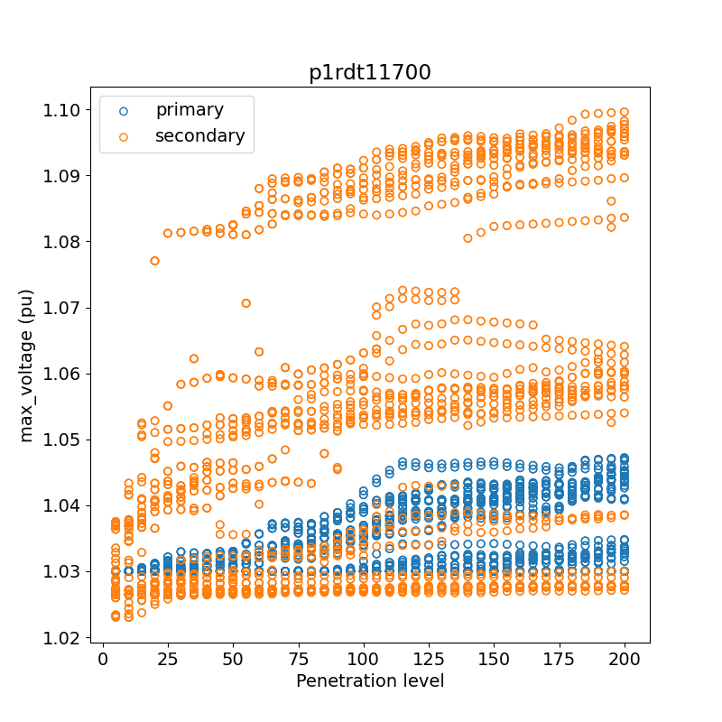

Hosting Capacity Analysis
=========================

This section shows how to conduct *hosting capacity analysis* using DISCO pipeline with *snapshot*
and *time-series* models as inputs. This tutorial assumes there's an existing ``snapshot-feeder-models`` 
directory generated from the ``transform-model`` command as below. The workflow below can also be 
applied to ``time-series-feeder-models``.

**1. Config Pipeline**

Check the ``--help`` option for creating pipeline template.

.. code-block:: bash

    $ disco create-pipeline template --help
    Usage: disco create-pipeline template [OPTIONS] INPUTS

    Create pipeline template file

    Options:
    -T, --task-name TEXT            The task name of the simulation/analysis
                                    [required]
    -P, --preconfigured             Whether inputs models are preconfigured
                                    [default: False]
    -s, --simulation-type [snapshot|time-series|upgrade]
                                    Choose a DISCO simulation type  [default:
                                    snapshot]
    --with-loadshape / --no-with-loadshape
                                    Indicate if loadshape file used for Snapshot
                                    simulation.
    --auto-select-time-points / --no-auto-select-time-points
                                    Automatically select the time point based on
                                    max PV-load ratio for snapshot simulations.
                                    Only applicable if --with-loadshape.
                                    [default: auto-select-time-points]
    -d, --auto-select-time-points-search-duration-days INTEGER
                                    Search duration in days. Only applicable
                                    with --auto-select-time-points.  [default:
                                    365]
    -i, --impact-analysis           Enable impact analysis computations
                                    [default: False]
    -h, --hosting-capacity          Enable hosting capacity computations
                                    [default: False]
    -u, --upgrade-analysis          Enable upgrade cost computations  [default:
                                    False]
    -c, --cost-benefit              Enable cost benefit computations  [default:
                                    False]
    -p, --prescreen                 Enable PV penetration level prescreening
                                    [default: False]
    -t, --template-file TEXT        Output pipeline template file  [default:
                                    pipeline-template.toml]
    -r, --reports-filename TEXT     PyDSS report options. If None, use the
                                    default for the simulation type.
    -S, --enable-singularity        Add Singularity parameters and set the
                                    config to run in a container.  [default:
                                    False]
    -C, --container PATH            Path to container
    -D, --database PATH             The path of new or existing SQLite database
                                    [default: results.sqlite]
    -l, --local                     Run in local mode (non-HPC).  [default:
                                    False]
    --help                          Show this message and exit.

Given an output directory from ``transform-model``, we use this command with ``--preconfigured`` option
to create the template.

.. code-block:: bash

    $ disco create-pipeline template -T SnapshotTask -s snapshot -h -P snapshot-feeder-models --with-loadshape

.. note:: For configuring a dynamic hosting capacity pipeline, use ``-s time-series``

It creates ``pipeline-template.toml`` with configurable parameters of different sections. Update
parameter values if needed. Then run

.. code-block:: bash

    $ disco create-pipeline config pipeline-template.toml

This command creates a ``pipeline.json`` file containing two stages:

* stage 1 - simulation
* stage 2 - post-process

Accordingly, there will be an output directory for each stage,

* output-stage1
* output-stage2

**2. Submit Pipeline**

With a configured DISCO pipeline in ``pipeline.json`` the next step is to submit the pipeline with
JADE:

.. code-block:: bash

    $ jade pipeline submit pipeline.json -o output

What does each stage do?

* In the simulation stage DISCO runs a power flow simulation for each job through PyDSS and stores
  per-job metrics.
* In the post-process stage DISCO aggregates the metrics from each simulation job, calculates
  the hosting capacity, and then ingests results into a SQLite database.

**3. Check Results**

The post-process stage aggregates metrics in the following tables in ``output/output-stage1``:

* ``feeder_head_table.csv``
* ``feeder_losses_table.csv``
* ``metadata_table.csv``
* ``thermal_metrics_table.csv``
* ``voltage_metrics_table.csv``

Each table contains metrics related to the *snapshot* or *time-series* simulation. DISCO
computes hosting capacity results from these metrics and then writes them to the following files,
also in ``output/output-stage1``:

* ``hosting_capacity_summary__<scenario_name>.json``
* ``hosting_capacity_overall__<scenario_name>.json``

The scenario name will be ``scenario``, ``pf1`` and/or ``control_mode``, depending on your 
simulation type and/or ``--with-loadshape`` option.

Note that DISCO also produces prototypical visualizations for hosting capacity automatically after each run:

* ``hca__{scenario_name}.png``

The voltage plot examples for the first feeder comparing pf1 vs. voltvar and comparing primary and secondary voltages:

* ``max_voltage_pf1_voltvar.png``
* ``max_voltage_pri_sec.png``

**4. Results database**

DISCO ingests the hosting capacity results and report metrics into a SQLite database named
``output/output-stage1/results.sqlite``. You can use standard SQL to query data, and perform
further analysis. 

If you want to ingest the results into an existing database, please specify the absolute path
of the database in ``pipeline.toml``.

For sqlite query examples, please refer to the Jupyter notebook ``notebooks/db-query.ipynb`` in
the source code repo.

If you would like to use the CLI tool ``sqlite3`` directly, here are some examples. Note that in
this case the database contains the results from a single task, and so the queries are not first
pre-filtering the tables.

If you don't already have ``sqlite3`` installed, please refer to their
`website <https://www.sqlite.org/download.html>`_.

Run this command to start the CLI utility:

.. code-block:: bash

    $ sqlite3 -table <path-to-db.sqlite>

.. note:: If your version of sqlite3 doesn't support ``-table``, use ``-header -column`` instead.

1. View DISCO's hosting capacity results for all feeders.

.. code-block:: bash

    sqlite> SELECT * from hosting_capacity WHERE hc_type = 'overall';

2. View voltage violations for one feeder and scenario.

.. code-block:: bash

    sqlite> SELECT feeder, scenario, sample, penetration_level, node_type, min_voltage, max_voltage
            FROM voltage_metrics
            WHERE (max_voltage > 1.05 or min_voltage < 0.95)
            AND scenario = 'pf1'
            AND feeder = 'p19udt14287';

3. View the min and max voltages for each penetration_level (across samples) for one feeder.

.. code-block:: bash

    sqlite> SELECT feeder, sample, penetration_level
            ,MIN(min_voltage) as min_voltage_overall
            ,MAX(max_voltage) as max_voltage_overall
            ,MAX(num_nodes_any_outside_ansi_b) as num_nodes_any_outside_ansi_b_overall
            ,MAX(num_time_points_with_ansi_b_violations) as num_time_points_with_ansi_b_violations_overall
            FROM voltage_metrics
            WHERE scenario = 'pf1'
            AND feeder = 'p19udt14287'
            GROUP BY feeder, penetration_level;

4. View the max thermal loadings for each penetration_level (across samples) for one feeder.

.. code-block:: bash

    sqlite> SELECT feeder, sample, penetration_level
            ,MAX(line_max_instantaneous_loading_pct) as line_max_inst
            ,MAX(line_max_moving_average_loading_pct) as line_max_mavg
            ,MAX(line_num_time_points_with_instantaneous_violations) as line_num_inst
            ,MAX(line_num_time_points_with_moving_average_violations) as line_num_mavg
            ,MAX(transformer_max_instantaneous_loading_pct) as xfmr_max_inst
            ,MAX(transformer_max_moving_average_loading_pct) as xfmr_max_mavg
            ,MAX(transformer_num_time_points_with_instantaneous_violations) as xfmr_num_inst
            ,MAX(transformer_num_time_points_with_moving_average_violations) as xfmr_num_mavg
            FROM thermal_metrics
            WHERE scenario = 'pf1'
            AND feeder = 'p19udt14287'
            GROUP BY feeder, penetration_level;
