Upgrade Cost Analysis
=====================

This chapter introduces the workflow for conducting *upgrade cost analysis* by using DISCO commands
step by step or DISCO pipeline, where the pipeline chains the individual steps and runs upgrade cost
analysis seamlessly. In the following two sections we will introduce the two methods separately.

The following commands run with default options. If you need any customization, please run ``--help`` on
the commands to see the available options.

Step-by-Step Workflow
---------------------

**1. Transform Model**

Prepare the model with PV deployments by using DISCO model transformation.

.. code-block:: bash

    $ disco transform-model tests/data/smart-ds/substations upgrade -o upgrade-models

Load shape profiles for ``Load`` elements are not used by the upgrade module, and so we recommend that
you remove them from the models in order to speed-up the simulations. Do so with this option:

.. code-block:: bash

    $ disco transform-model tests/data/smart-ds/substations upgrade --exclude-load-profile -o upgrade-models

**2. Create Config**

With the transformed model, create the `config.json` file with submittable jobs.

.. code-block:: bash

    $ disco config upgrade upgrade-models

DISCO will use default upgrade parameters if the option ``--params-file`` is not specified.
If ``--params-file`` is specified, that file must contain all required parameters.

Here are optional parameters that you can customize in the same file:

.. code-block::

    [thermal_upgrade_params]
    parallel_transformer_limit = 4
    parallel_lines_limit = 4
    upgrade_iteration_threshold = 5
    timepoint_multipliers = {}

    [voltage_upgrade_params]
    capacitor_sweep_voltage_gap = 1.0
    reg_control_bands = [1, 2]
    reg_v_delta = 0.5
    max_regulators = 4
    place_new_regulators = false
    use_ltc_placement = false
    timepoint_multipliers = {}
    capacitor_action_flag = true
    existing_regulator_sweep_action = true

**3. Submit Jobs**

Submit jobs by using JADE and conduct upgrade cost analysis within each job. 
This command assumes that you are running on a local system. Please remove the option
``--local`` if you run on an HPC.

.. code-block:: bash

    $ jade submit-jobs config.json --local --force

This step will generate the directory ``output``, which contains all upgrade results.

**4. Upgrade Analysis**

Run post-processing to aggregate upgrade cost analysis results and create analysis CSV tables.

.. code-block:: bash

    $ disco-internal make-upgrade-tables output

If everything succeeds, it produces two aggregated tables: ``upgrade_summary.csv`` and
``total_upgrade_costs.csv``. 

Pipeline Workflow
-----------------

**1. Create Template**

Create a DISCO pipeline template file. By default, the output file is ``pipeline-template.toml``.

.. code-block:: bash

    $ disco create-pipeline template --task-name UpgradeTask --simulation-type upgrade --upgrade-analysis ~/Workspace/disco/tests/data/smart-ds/substations

Here, we need to enable the ``--upgrade-analysis`` option.

**2. Config Pipeline**

Update the pipeline template file for customization if needed. Then create the pipeline config file
``pipeline.json`` with this command.

.. code-block:: bash

    $ disco create-pipeline config pipeline-template.toml

**3. Submit Pipeline**

Submit the pipeline with JADE

.. code-block:: bash

    $ jade pipeline submit pipeline.json

If everything succeeds, it produces same aggregated upgrade tables in ``output-stage1``.

Technical Details
-----------------
The automated upgrades module consists of three components as shown in the figure: it performs traditional infrastructure upgrades to resolve both thermal and voltage violations, 
and then computes the costs associated with each of those upgrades.

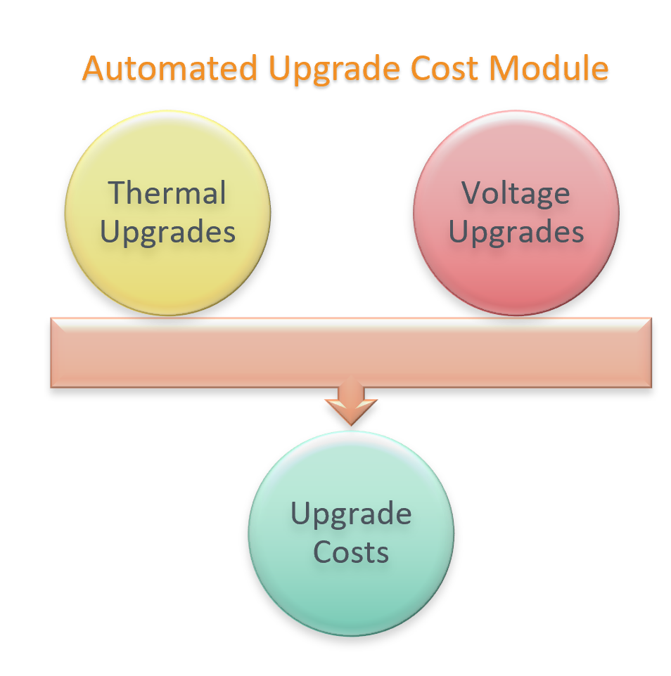

A high level overview of thermal and voltage upgrades considerations is shown below:

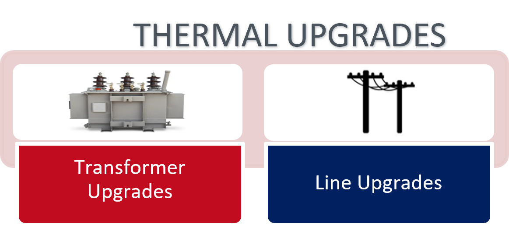

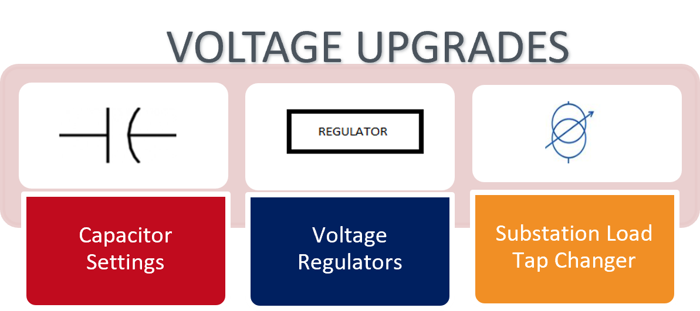

**1. Thermal Upgrades Workflow**

In this sub-module, the thermal equipment (lines and transformers) violations are identified, and upgrades are determined as per the flowchart given below.

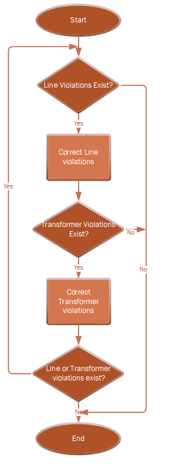

The technical equipment database is a catalog of available lines and transformers and can optionally be provided as an input. 
All the equipment in this database will be considered as available options while determining thermal upgrades. 
If this file is not provided, a technical database will be automatically generated from the given feeder model. 
This would provide the thermal upgrades module with a limited set of upgrade options.
Sample technical equipment catalog can be found `here <https://github.com/NREL/disco/blob/main/disco/extensions/upgrade_simulation/upgrades/smartds_upgrades_technical_catalog.json>`_

For an overloaded equipment, if a higher rated equipment of similar configuration is available in the technical catalog, that is considered as an upgrade and is chosen.
Else, similar configuration equipment are added in parallel to resolve the observed violations. 
Sometimes, extreme thermal equipment overloaded can also cause voltage issues. So, it can be seen that thermal upgrades also resolve some undervoltage violations.

**2. Voltage Upgrades Workflow**

In this sub-module, the voltage violations present in the feeder are identified, and are resolved as shown in flowchart below:

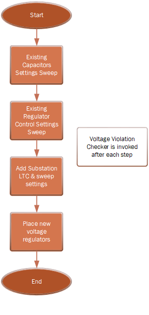

*a.  Existing Capacitors:*

* If capacitors are present

    * If capacitor control is present for a capacitor: correct capacitor control parameters i.e. PT ratio is checked and corrected (if needed)
    * If capacitor control is present, it is changed to voltage-controlled (if it is of any other kind) 
    * If capacitor control is not present, voltage-controlled capacitor control is added and default control settings are applied to any newly added controller

* A settings sweep is performed through all capacitor settings, and setting with least number of violations is chosen. If initial settings are best, no changes are made. In the capacitor settings sweep method, same settings are applied to all capacitors.

*b.  Existing Regulators:*

* If voltage regulators are present, regulator control parameters (like ptratio) are corrected (if needed), including for substation LTC.

* A settings sweep is performed for existing regulator control devices (excluding substation LTC). 
    * In this settings sweep method, same settings are applied to all regulators

*c. Add new Regulator:*

* A new regulator is added by clustering nearby buses with violations and testing regulator placement (one at a time) on each of the common upstream nodes. The placement option with least number of violations is chosen. 

**3. Upgrades Cost computation**
A unit cost database is used to determine the total costs associated thermal and voltage upgrades determined through the workflows described above.
Sample input cost database can be found `here <https://github.com/NREL/disco/blob/main/disco/extensions/upgrade_simulation/upgrades/Generic_DISCO_cost_database_v2.xlsx>`_

Input parameters
~~~~~~~~~~~~~~~~

In order to run this simulation, the following inputs are needed. For required fields, example inputs are provided, and for optional parameters, default inputs are shown.

*1. Thermal Upgrade Inputs*

The input parameters for thermal upgrades are shown in table below. For required fields, example inputs are provided, and for optional parameters, default inputs are shown.

.. csv-table:: Thermal Upgrade Inputs
   :file: ../images/thermal_inputs.csv
   :header-rows: 1

*2. Voltage Upgrade Inputs*

The input parameters for voltage upgrades are shown in table below. 

.. csv-table:: Voltage Upgrade Inputs
   :file: ../images/voltage_inputs.csv
   :header-rows: 1

*3. Simulation Input Parameters*

In addition to the thermal and voltage input parameters, there are a few other simulation parameters which need to be provided.

.. csv-table:: Simulation input parameters
   :file: ../images/simulation_params.csv
   :header-rows: 1

Outputs
~~~~~~~

*1. Costs*

.. csv-table:: Output costs
   :file: ../images/output_costs.csv
   :header-rows: 1

*2. Summary*

.. csv-table:: Output summary
   :file: ../images/output_summary.csv
   :header-rows: 1

Example
~~~~~~~

For a feeder with thermal and voltage violations, the following figures show the violations in a feeder before and after upgrades.

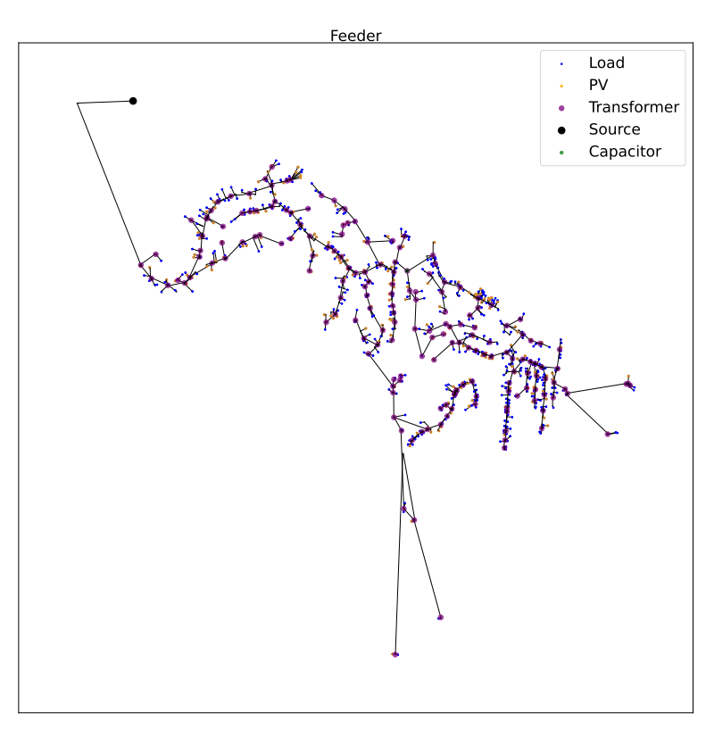

*1. Thermal Upgrades*

The following figures show the thermal violations in a feeder before and after thermal upgrades:

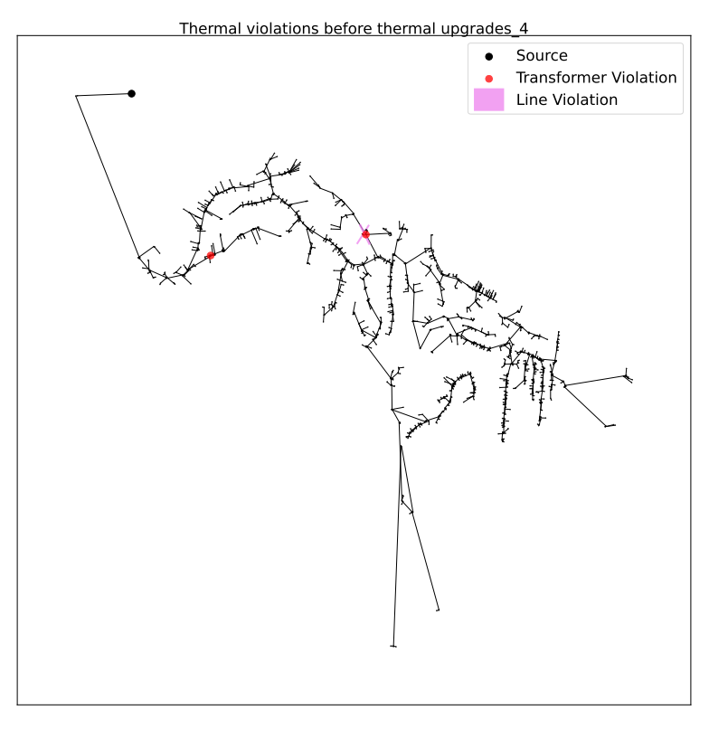

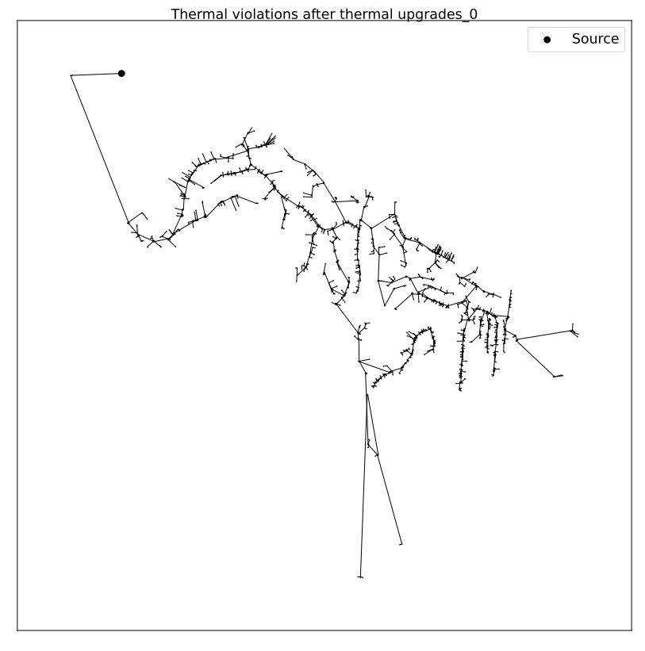

The following figures show the voltage violations in a feeder before and after thermal upgrades:

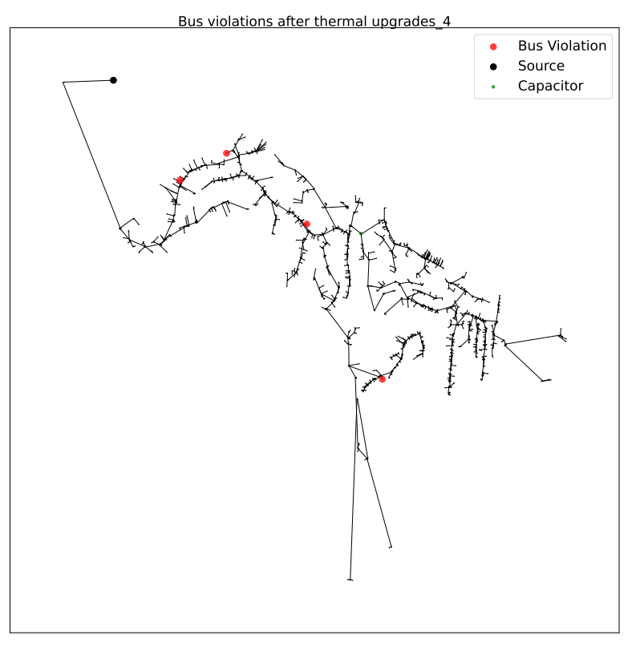

*2. Voltage Upgrades*

The following figures show the voltage violations in a feeder before and after voltage upgrades:

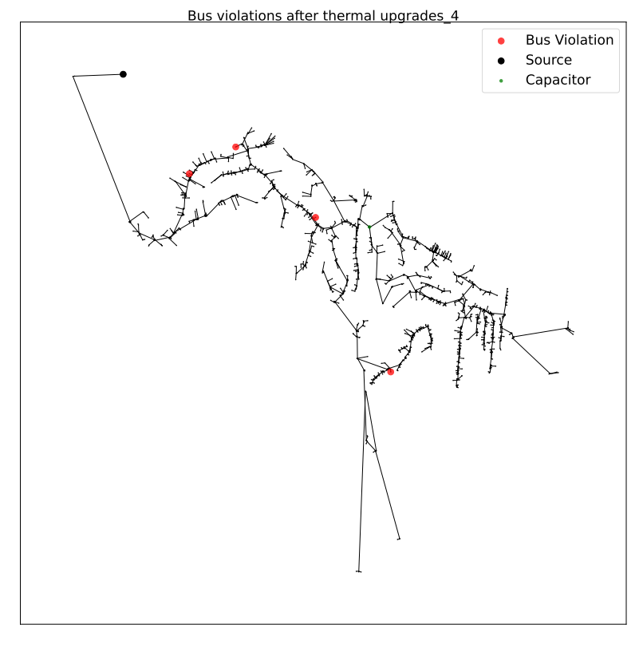

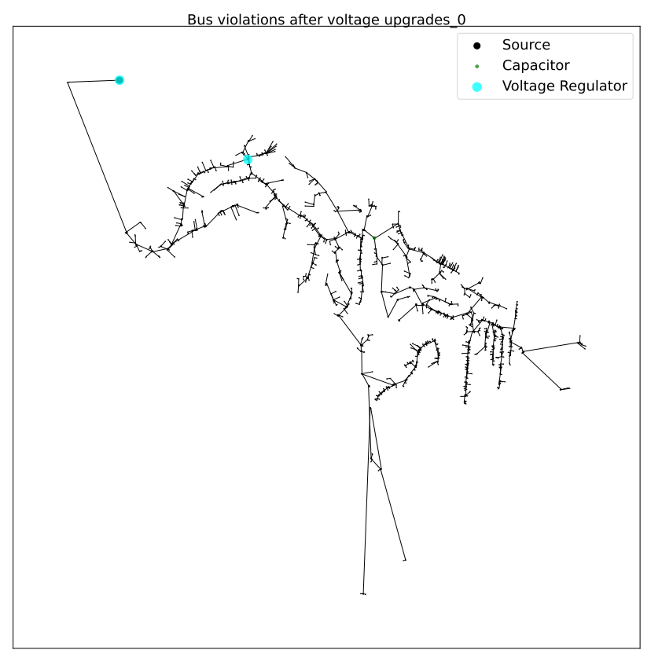

