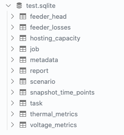

**************
Data Ingestion
**************

DISCO could ingest simulation metrics and analysis results into sqlite database, which
facilitates the data sharing between researchers, and data query for further investigation.

Ingest to New Database
======================

Suppose we are assigned a task which requires us to run DISCO pipeline for 
hosting capacity analysis with snapshot simulation, and generate pipeline output directory 
named ``/data/snapshot-output/`` with simulation and analysis result. 

Run the command below, and it could help us to ingest the results into a database.

.. code-block:: bash

    $ disco ingest-tables --task-name "SFO P1U Snapshot" --model-inputs /data/input-models/ --database=test.sqlite /data/snapshot-output/

It will create a database named ``test.sqlite`` with data tables like below,

Ingest to Existing Database
===========================

Now we are assigned a second task, and need to run DISCO pipeline for hosting capacity with
time-series simulation. After the task was complete, we got the output with ``/data/time-series-output``.
Again, we would like to ingest the database into the database.

We have two choices for data ingestion,

1. Ingest the results into a new database, let's say, ``data.sqlite``.
2. Or ingest the results into existing database, for example, the one we created above ``test.sqlite``.

If choose option 1, then just run the command above with new ``--database`` value specified. 
Here, we would like to choose option2, and ingest the results of second task into an existing database,
`test.sqlite` created before. To perform this, we need to assign ``--task-name`` a different value,
otherwise, it would prevent the data ingestion, as the task for each ingestion is unique.

.. code-block: bash

    $ disco ingest-tables --task-name "SFO P1U Time-series" --model-inputs /data/input-models/ --database=test.sqlite /data/time-series-output/

.. note::

    Task names need to be unique. It's recommended to create a naming convention of task names 
    for better managing the simulation and analysis results, for example, ``<geography> <simulation_type>``.

Run Database Queries
====================

Create a db connection,

.. code-block:: python

    import sqlite3
    conn = sqlite3.connect("test.sqlite")

Run sql query by using ``pandas``,

.. code-block:: python

    import pandas as pd
    query1 = "SELECT * FROM task"
    df = pd.read_sql_query(query1, conn)

    query2 = ""

For more query examples, please refer to the Jupyter notebook in this repository ``db-query.ipynb``.
