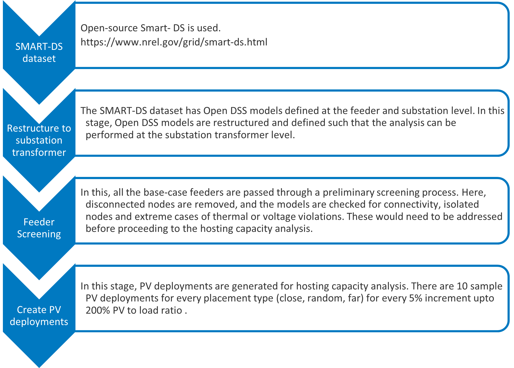

**********************************
SMART-DS OpenDSS Model Preparation
**********************************
Hosting Capacity Analysis makes use of the OpenDSS models from the `SMART-DS <https://data.openei.org/s3_viewer?bucket=oedi-data-lake&prefix=SMART-DS%2Fv1.0%2F2018%2F>`_ dataset.
More documentation on the open source SMART-DS datasets can be found `here <https://github.com/openEDI/documentation/tree/main/SMART-DS>`_.
Pre-processing is performed on this dataset to prepare it for the analysis. The chart below shows the various stages of pre-processing performed on the SMART-DS OpenDSS Models.

Copy SMART-DS Dataset
=====================
The dataset can be copied to the analysis location using https://github.com/NREL/disco/blob/main/scripts/copy_smart_ds_dataset.py

Usage:

.. code-block:: bash

    $ python ~/sandboxes/disco/scripts/copy_smart_ds_dataset.py -y 2018 -c SFO -v v1.0 /projects/distcosts3/SMART-DS

Here is the help:

.. code-block:: bash

   $ python ~/sandboxes/disco/scripts/copy_smart_ds_dataset.py --help

    Usage: copy_smart_ds_dataset.py [OPTIONS] OUTPUT_DIR

      Copy a SMART-DS from the Eagle source directory to a destination directory.

    Options:
      -f, --force         overwrite output-dir if it exists
      -c, --city TEXT     dataset city  [required]
      -y, --year TEXT     dataset year  [required]
      -v, --version TEXT  dataset version  [required]
      --help              Show this message and exit.

Restructure to substation transformer
=====================================
The SMART-DS dataset has Open DSS models defined at the feeder and substation level. In this stage, Open DSS models are restructured and defined such that the analysis can be performed at the substation transformer level. 
This can be performed using https://github.com/NREL/disco/blob/main/scripts/smartds_restructuring_transformer_folder.py

Usage:

.. code-block:: bash

    $ python ~/sandboxes/disco/scripts/smartds_restructuring_transformer_folder.py BASE_PATH ORIGINAL_DATASET NEW_DATASET LIST_OF_REGIONS

Example:

.. code-block:: bash

    $ python ~/sandboxes/disco/scripts/smartds_restructuring_transformer_folder.py /projects/distcosts3/SMART-DS/v1.0/2018 SFO SFO_xfmr P1U,P1R,P2U

Feeder screening & model fixes
==============================
In this, all the base-case feeders are passed through a preliminary screening process. 
Here, disconnected nodes are removed, and the models are checked for connectivity, isolated nodes and extreme cases of thermal or voltage violations.
These would need to be addressed before proceeding to the hosting capacity analysis. This can be done using https://github.com/NREL/Distribution-Integration-Analysis/blob/master/scripts-simulation/generate_screening_jobs.py

Usage:

.. code-block:: bash

    $ python generate_screening_jobs.py PATH_TO_REGIONS

Example:

.. code-block:: bash

    $ python generate_screening_jobs.py /projects/distcosts3/SMART-DS/v1.0/2018/SFO

Create PV deployments
=====================
In this stage, PV deployments are generated for hosting capacity analysis. There are 10 sample PV deployments for every placement type (close, random, far) for every 5% increment upto 200% PV to load ratio . 
This can be done using disco, refer to the :ref:`PVDeployments` documentation.
