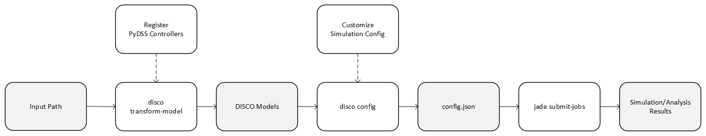

********
Overview
********

This section gives an overview about DISCO and its workflows.

DISCO can be used for distributed grid system simulation analysis.
The analysis types are:

* snapshot impact analysis
* hosting capacity analysis (based on snapshot impact analysis results)
* time series impact analysis
* time series hosting capacity

The diagram below shows the DISCO workflow:

As shown from the diagram, the main steps to run an analysis workflow are:

* Prepare the OpenDSS models with a given data source.
* Transform the source OpenDSS models into DISCO models.
* Configure JADE jobs with the DISCO models.
* Run the jobs with JADE.

Data Sources
============

DISCO supports OpenDSS models in several data formats:

#. GEM Model, Grid-connected Energy systems Modeling

#. EPRI Model - J1, K1, and M1, https://dpv.epri.com/feeder_models.html

#. SourceTree1 Model, this format requires directory structure *tree1* defined by DISCO - :ref:`SourceTree1Model`.

#. SourceTree2 Model, this format requires directory structure *tree2* defined by DISCO - :ref:`SourceTree2Model`.

Transform Model
===============

Given an analysis type, the source OpenDSS models need to be transformed into 
DISCO models which then can be used as inputs for configuring JADE jobs.

Config Jobs
===========

DISCO configures JADE jobs from standard DISCO models for specific analysis
types. The output is a configuration JSON file.

Submit Jobs
===========

JADE parallelizes execution of the jobs on a local computer or an HPC.
Execution on an HPC is highly configurable depending on the job resource
requirements.

Result Analysis
===============

After jobs complete JADE can assist with analysis by showing summaries of
individual job status, errors and events, job execution times, and compute
resource utilization statistics.
